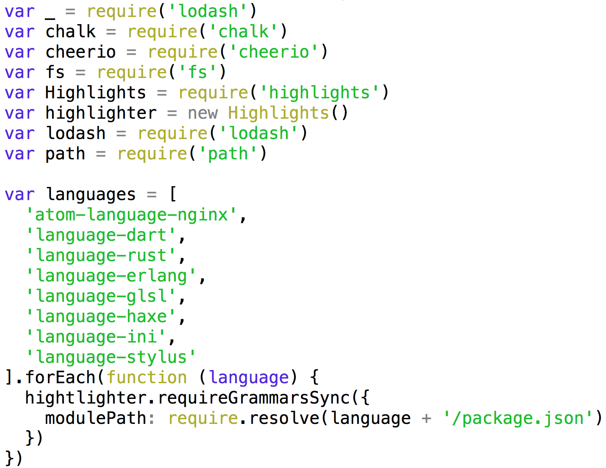

# hl

Use Atom's syntax-highlighter from the command line.

```sh
npm install hl -g
```

Provides syntax highlighting for:

* JavaScript
* Ruby
* JSON
* ObjectiveC
* CPP
* Markdown

Open an issue or pull-request if we're missing a language you'd like to see!

## Usage

```sh
hl index.js
hl main.rb
hl foo.m
hl package.json
```

You can also use unix pipes:

```sh
cat index.rb | hl --extension=rb
```



## API

```js
var hl = require('hl')
var out = hl('index.js', {
  numeric: 'yellow'
})
console.log(out)
```

## License

ISC
